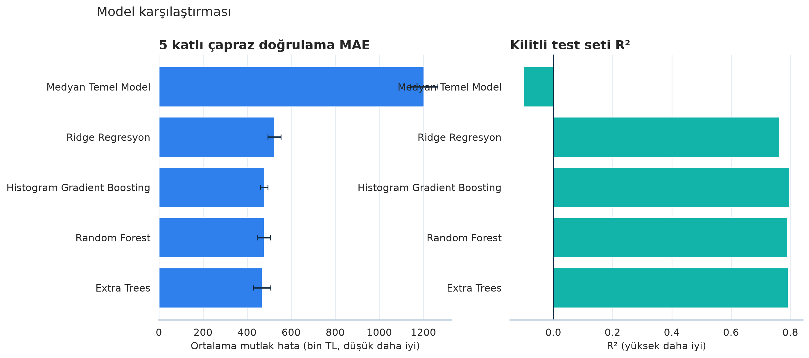
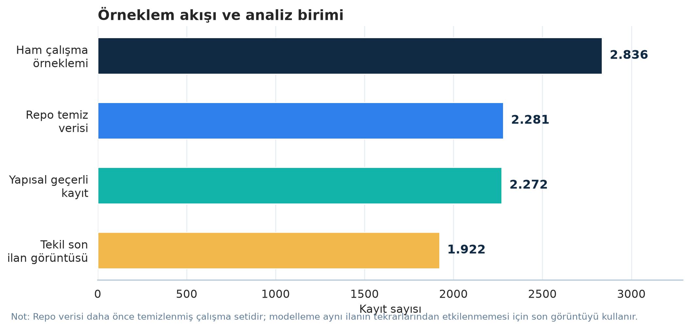

# Samsun / Atakum Konut Fiyat Analizi

Bu depo, Atakum ilçesindeki konut ilanlarını inceleyen lisans bitirme çalışmasının
tekrarlanabilir analiz sürümüdür. İstatistiksel testler, hedonik fiyat modeli,
makine öğrenmesi karşılaştırmaları, yayın kalitesinde grafikler ve etkileşimli bir
Streamlit dashboardu aynı veri hazırlama hattını kullanır.

> **Kapsam:** Çalışmanın hedef değişkeni gerçekleşmiş satış bedeli değil, ilandaki
> talep fiyatıdır. Üretilen tahminler resmi ekspertiz veya yatırım tavsiyesi değildir.



## Öne çıkan çıktılar

| Başlık | Sonuç |
|---|---:|
| Repodaki temizlenmiş kayıt | 2.281 |
| Yapısal olarak geçerli ilan görüntüsü | 2.272 |
| Tekilleştirilmiş son ilan görüntüsü | 1.922 |
| En iyi model | Extra Trees |
| Kilitli test MAE | 484.507 TL |
| Kilitli test RMSE | 695.408 TL |
| Kilitli test R² | 0,793 |
| Test MAPE | %14,34 |
| Bootstrap %95 MAE aralığı | 436.336–535.998 TL |

Model yalnızca eğitim bölümündeki beş katlı çapraz doğrulama sonuçlarıyla seçilmiş,
ardından daha önce görülmemiş kilitli test bölümü üzerinde bir kez değerlendirilmiştir.
Kronolojik ve ilan-kimliği gruplu ek kontroller, performansın veri bölme yaklaşımına
duyarlılığını ayrıca gösterir.

## Veri soyu hakkında önemli not

Çalışmanın ilk ham örneklem büyüklüğü **2.836** olarak bildirilmiştir. Repodaki
`veriseti.xlsx` dosyasında **2.281** kayıt bulunduğundan, aradaki **555 kayıt** bu
yenileme çalışmasından önceki veri temizleme aşamasında elenmiştir. İlk ham dosya
repoda bulunmadığı için bu 555 kaydın satır bazında hangi gerekçelerle çıkarıldığı
geriye dönük olarak doğrulanamaz.

Mevcut hat ikinci bir aykırı değer silme işlemi uygulamaz. Yalnızca 9 yapısal olarak
bozuk kaydı ayırır ve aynı ilan numarasına ait tarihsel görüntüler arasından en güncel
olanı seçer. Böylece ana analiz 1.922 tekil ilanla yürütülür. `169 tam kopya` ve
`665 tekrarlı görüntü satırı` denetim göstergeleridir; farklı kümeleri ölçtükleri için
silinen kayıt sayılarına doğrudan eklenmemelidir.



## Hızlı başlangıç

Python 3.10 veya üzeri önerilir.

```bash
git clone https://github.com/Blacksidemre/Bitirme-Tezi.git
cd Bitirme-Tezi
python -m venv .venv
source .venv/bin/activate        # Windows: .venv\Scripts\activate
python -m pip install --upgrade pip
pip install -e ".[dashboard,thesis]"
```

Analizlerin tamamını yeniden üretmek için:

```bash
python analiz_icin_kodlar.py
```

Aynı işlem komut satırı seçenekleriyle de çalıştırılabilir:

```bash
atakum-housing \
  --data veriseti.xlsx \
  --output-dir outputs/latest \
  --reported-raw-rows 2836 \
  --random-state 42
```

Dinamik dashboardu açmak için:

```bash
streamlit run dashboard/app.py
```

Dashboard; mahalle, oda tipi, fiyat ve metrekare filtreleri; model karşılaştırması;
özellik önemi; değerlendirme protokolü duyarlılığı; veri kalite hunisi; CSV dışa
aktarma ve senaryo bazlı fiyat simülatörü içerir.

## Yenilenmiş tez

- [Düzenlenebilir tez (DOCX)](docs/Atakum_Konut_Fiyatlari_Yenilenmis_Tez.docx)
- [Teslime hazır görünüm (PDF)](docs/Atakum_Konut_Fiyatlari_Yenilenmis_Tez.pdf)
- [Model kartı](docs/MODEL_KARTI.md)
- [Veri sözlüğü](docs/VERI_SOZLUGU.md)

Tez dosyasını güncel analiz çıktılarından yeniden oluşturmak için:

```bash
python scripts/build_thesis.py
```

Betik DOCX üretir. PDF sürümü, DOCX'in LibreOffice veya Microsoft Word ile PDF'e
aktarılmasıyla yenilenebilir. Üniversitenin güncel yazım kılavuzu bilinmediği için
teslimden önce kapak, onay sayfası, danışman bilgisi ve kurumsal biçim kuralları
öğrenci tarafından kontrol edilmelidir.

## Analiz tasarımı

1. Türkçe tarihlerin ayrıştırılması ve yapısal veri kontrolleri
2. İlan numarası temelinde en güncel görüntünün seçilmesi
3. Tanımlayıcı istatistikler ve Spearman korelasyonları
4. Holm düzeltmeli Mann–Whitney testleri ve Kruskal–Wallis etki büyüklüğü
5. HC3 dayanıklı standart hatalı yarı-log hedonik regresyon
6. Medyan temel model, Ridge, Random Forest, Extra Trees ve Histogram Gradient Boosting karşılaştırması
7. Eğitim içi çapraz doğrulama, kilitli test, bootstrap güven aralığı ve sızıntı duyarlılığı

Tüm modeller; eksik değer doldurma, standartlaştırma ve kategorik kodlama adımlarını
tek bir `scikit-learn` hattı içinde uygular. Hedef değişken `log1p` dönüşümüyle
modellenip sonuçlar yeniden TL ölçeğine çevrilir.

## Proje yapısı

```text
.
├── analiz_icin_kodlar.py          # Geriye uyumlu analiz başlatıcısı
├── dashboard/app.py               # Streamlit dashboardu
├── docs/                          # Yenilenmiş tez ve teknik belgeler
├── outputs/latest/                # Tablolar, grafikler ve analiz özetleri
├── scripts/build_thesis.py        # Tez üretim betiği
├── src/atakum_housing/            # Veri, istatistik, modelleme ve görselleştirme paketi
├── tests/                         # Veri, model ve dashboard testleri
└── veriseti.xlsx                  # Repodaki temizlenmiş çalışma verisi
```

`outputs/latest/models/en_iyi_model.joblib` yeniden üretilebilir ve boyutu nedeniyle
Git tarafından izlenmez. Dashboard kendi simülasyon modelini önbellekli biçimde
çalışma anında kurar.

## Tekrarlanabilirlik ve test

```bash
pip install -e ".[dashboard,dev,thesis]"
ruff check .
pytest
```

Rastgele bölmelerde `random_state=42` kullanılır. Sürüm aralıkları `pyproject.toml`
içinde tanımlıdır ve GitHub Actions, Python 3.10 ve 3.12 üzerinde lint/test koşar.

## Başlıca sınırlılıklar

- Veri tek bir ilan platformunun ve Atakum ilçesinin örneklemidir.
- İlan fiyatı, gerçekleşen satış fiyatı değildir.
- Tarihler büyük ölçüde Nisan–Mayıs 2025 döneminde yoğunlaşır.
- Ham 2.836 satırlık dosya bulunmadığından önceden elenen 555 kayıt yeniden denetlenemez.
- Manzara, cephe, iç kalite, ulaşım süresi ve kesin konum gibi değişkenler yoktur.
- Fiyat simülatörü veri aralığının dışına taşan senaryolar için güvenilir kabul edilmemelidir.

Ayrıntılı değerlendirme sınırları ve kullanım notları için [model kartına](docs/MODEL_KARTI.md)
bakın.
